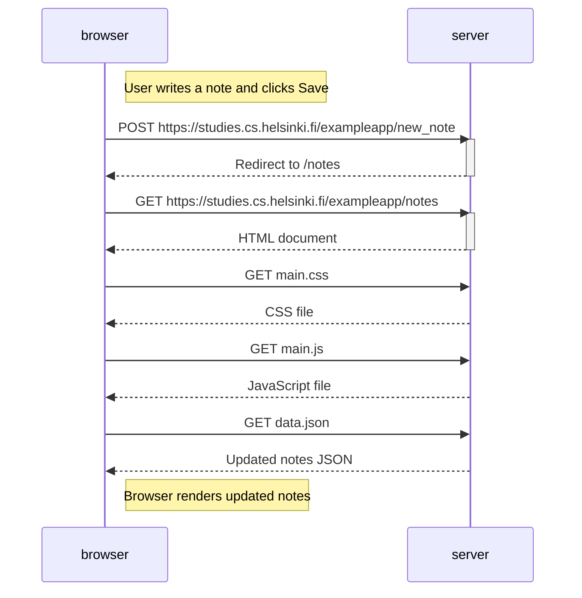
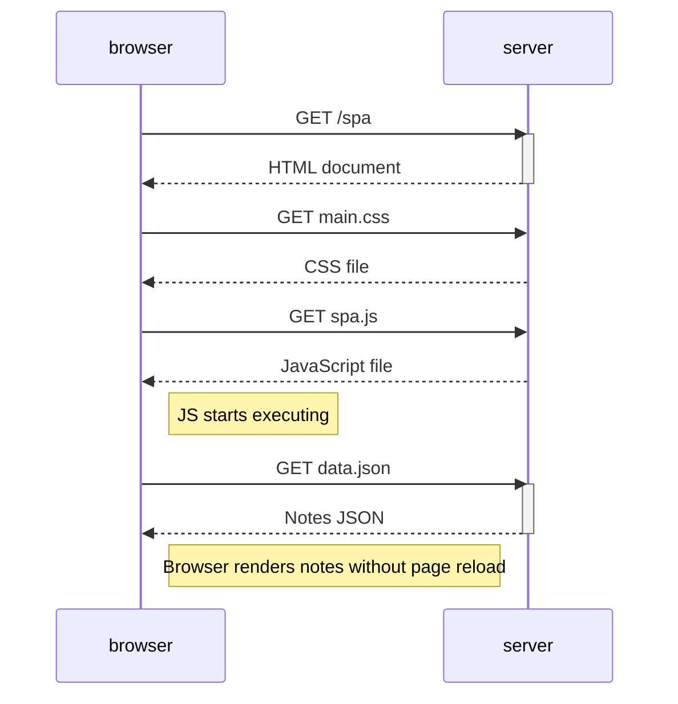
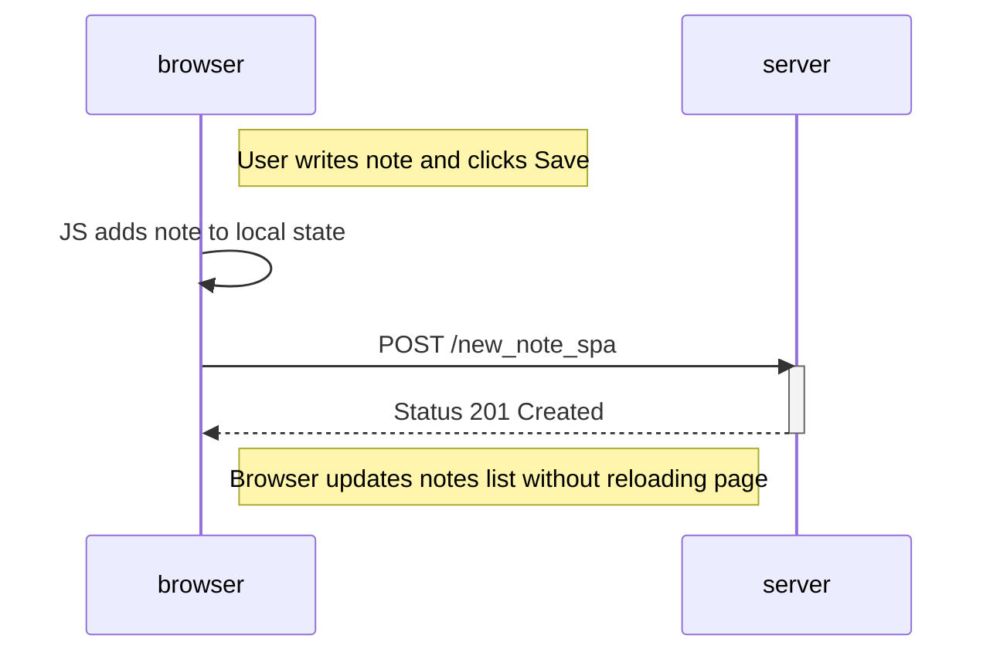

```mermaid
sequenceDiagram
    participant browser
    participant server

    Note right of browser: User writes a note and clicks Save

    browser->>server: POST https://studies.cs.helsinki.fi/exampleapp/new_note
    activate server
    server-->>browser: Redirect to /notes
    deactivate server

    browser->>server: GET https://studies.cs.helsinki.fi/exampleapp/notes
    activate server
    server-->>browser: HTML document
    deactivate server

    browser->>server: GET main.css
    server-->>browser: CSS file

    browser->>server: GET main.js
    server-->>browser: JavaScript file

    browser->>server: GET data.json
    server-->>browser: Updated notes JSON

    Note right of browser: Browser renders updated notes
```

```mermaid
sequenceDiagram
    participant browser
    participant server

    browser->>server: GET /spa
    activate server
    server-->>browser: HTML document
    deactivate server

    browser->>server: GET main.css
    server-->>browser: CSS file

    browser->>server: GET spa.js
    server-->>browser: JavaScript file

    Note right of browser: JS starts executing

    browser->>server: GET data.json
    activate server
    server-->>browser: Notes JSON
    deactivate server

    Note right of browser: Browser renders notes without page reload
```

```mermaid
sequenceDiagram
    participant browser
    participant server

    Note right of browser: User writes note and clicks Save

    browser->>browser: JS adds note to local state

    browser->>server: POST /new_note_spa
    activate server
    server-->>browser: Status 201 Created
    deactivate server

    Note right of browser: Browser updates notes list without reloading page
```
